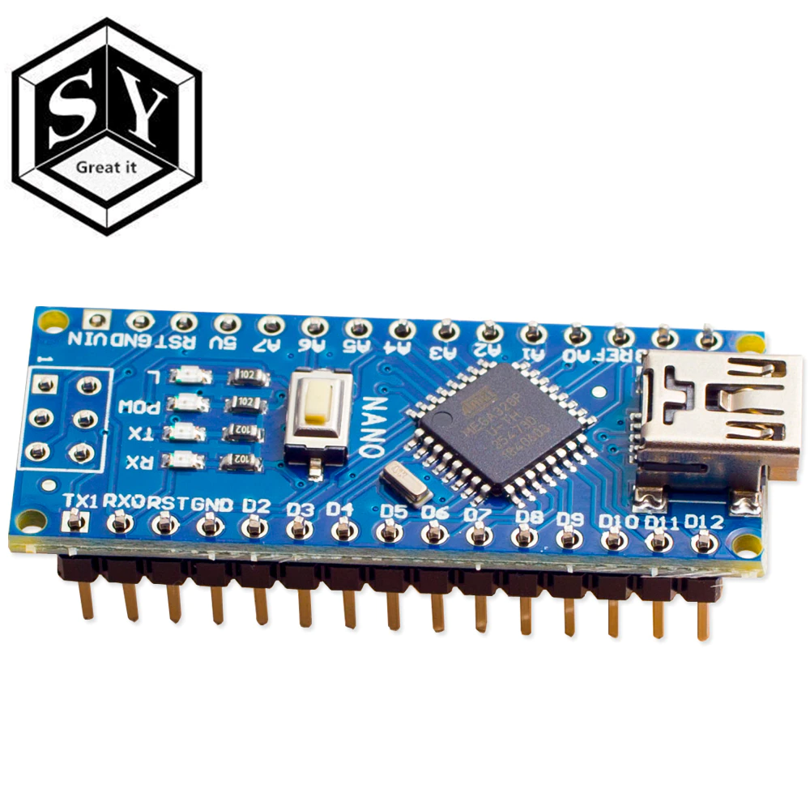
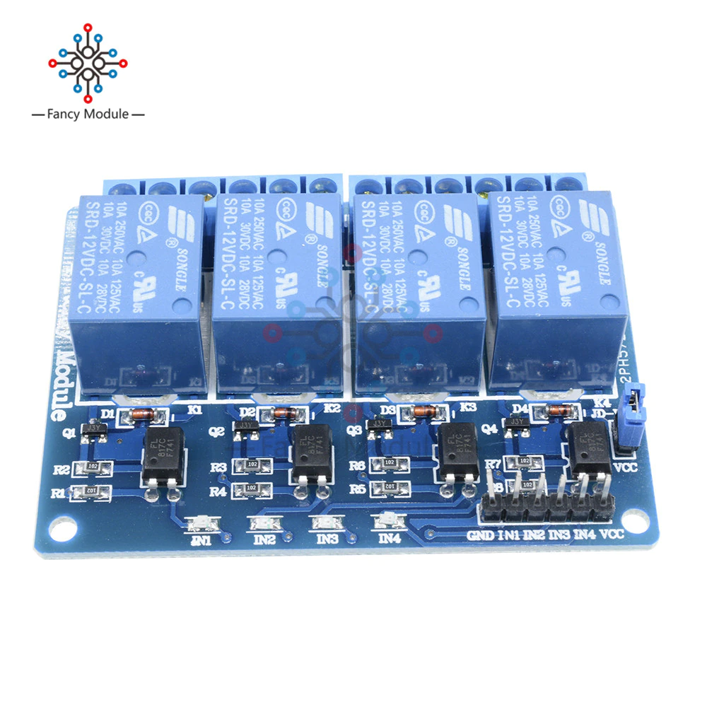
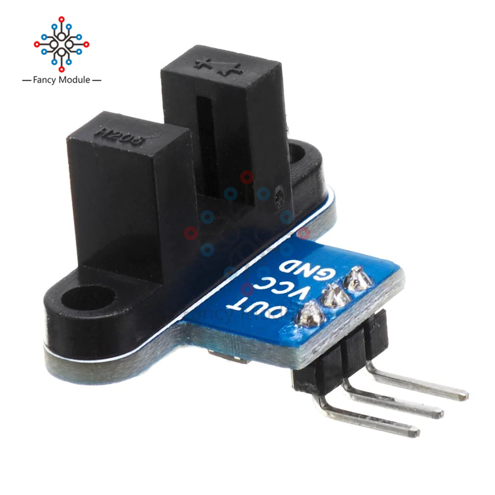
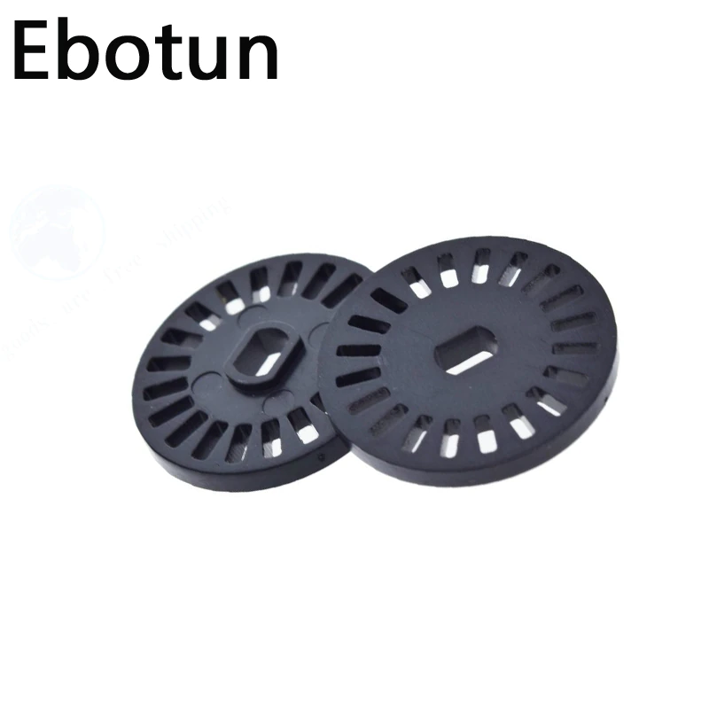

# Automatique chicken coop door

## Build of material

|Image|Description|Quantity|Price
|---|---|---|---|
||[Arduino Nano](https://www.aliexpress.com/item/4000430870768.html)|1|6€|
||[4 Relay Modules 12V](https://www.aliexpress.com/item/32962362750.html)|1|3€|
||[12V 2A Power Supply](https://www.aliexpress.com/item/4001159381316.html)|1|3€|
||[12V Motor + Reductor 40rpm](https://www.aliexpress.com/item/32888516547.html)|1|9€|
||[Photosensitive 5V](https://www.aliexpress.com/item/1215447668.html)|1|1€40|
||[Speed Measure sensor 5V](https://www.aliexpress.com/item/1005001653555599.html)|1|2€70|
||[Disque encoder](https://www.aliexpress.com/item/1005001954155530.html)|1|2€60|

#
## Conso
### 12V Power supply
Arduino = 5mA  
Relay = 5mA max per relay  
Motor = 40mA pick  
**Total: 65mA**
#
## Schematics

