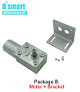

# Automatique chicken coop door

## Build of material

|Image|Description and link|Quantity|Price
|---|---|---|---|
||[Arduino Nano](https://www.aliexpress.com/item/4000430870768.html)|1|6€|
||[4 Relay Modules 12V](https://www.aliexpress.com/item/32962362750.html)|1|3€|
||[12V 2A Power Supply](https://www.aliexpress.com/item/4001159381316.html)|1|3€|
||[12V Motor + Reductor 40rpm](https://www.aliexpress.com/item/32888516547.html)|1|9€|
||[Photosensitive 5V](https://www.aliexpress.com/item/1215447668.html)|1|1€40|
||[Speed Measure sensor 5V](https://www.aliexpress.com/item/1005001653555599.html)|1|2€70|
||[Disque encoder](https://www.aliexpress.com/item/1005001954155530.html)|1|2€60|
||[H Bridge motor control](https://fr.aliexpress.com/item/32224772756.html?spm=a2g0o.productlist.0.0.2b7b43c65wbdqH&algo_pvid=714b6173-d359-4a96-afcc-b728c91988f5&algo_expid=714b6173-d359-4a96-afcc-b728c91988f5-3&btsid=0b0a0ac216233185346996889e65f2&ws_ab_test=searchweb0_0,searchweb201602_,searchweb201603_)|1|1€06|


#
## Conso
### 12V Power supply
Arduino = 5mA <br>
Relay = 5mA max per relay <br>
Motor = 40mA pick <br>
**Total: 65mA**
#
## Schematics


## Program
Just flash the .ino progam into your arduino Nano using ArduinoIDE

## Adjust the motor
Adjust the xxxx in:
```C
#define DOOR_MOVE_TIME xxxx
```
xxxx is the time to open or close the door in minisecondes
